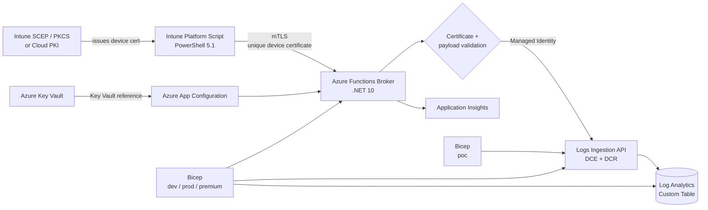

# 📡 Intune Deployment Telemetry

> **Open-source endpoint telemetry for measuring Microsoft Intune policy
> delivery latency and separating service delay from device unavailability.**

`PowerShell 5.1` · `.NET 10` · `Azure Functions` · `Microsoft Intune` ·
`mTLS` · `Azure Monitor` · `Log Analytics` · `Bicep` · `KQL`

[](https://github.com/robgrame/intune-deployment-telemetry/actions/workflows/ci.yml)
[](https://github.com/robgrame/intune-deployment-telemetry/actions/workflows/codeql.yml)

## ✨ Why this project exists

Intune reports when a script or policy reaches a device, but that timestamp
alone doesn't explain *why* delivery was late. This project correlates the
first endpoint execution with boot time, uptime, local MDM activity,
EnterpriseMgmt tasks, and DMEDP events.

| Question | Evidence |
|---|---|
| Did the device receive the script late? | Assignment and immutable first-execution timestamps |
| Was the device offline? | Boot time, uptime, and last local MDM activity |
| How many MDM cycles elapsed? | Correlated DMEDP activity IDs and bounded event clustering |
| Is the delay tenant-wide? | P50, P95, and P99 KQL queries |
| Can endpoints write directly to Azure Monitor? | Only in the constrained `poc`; supported profiles use the broker |

## 🏗️ Architecture



In `dev`, `prod`, and `premium`, the endpoint never receives a workspace key,
app secret, or Azure token. Azure access is confined to the broker's
system-assigned managed identity, scoped to the Data Collection Rule. The
`poc` profile is an explicit direct-ingestion exception using a dedicated
application certificate.

Runtime settings are centralized under the `IntuneTelemetry:` prefix in Azure
App Configuration. Trust material and future secrets are stored in Key Vault
and resolved through App Configuration Key Vault references.

Read the [architecture](docs/architecture.md) and
[certificate authentication](docs/certificate-authentication.md) guides.

## 📦 Deployment SKUs

| Capability | `poc` | `dev` | `prod` | `premium` |
|---|---:|---:|---:|---:|
| Functions plan | None | Consumption `Y1` | Elastic Premium `EP1` | Elastic Premium `EP2` |
| Minimum workers | N/A | 0 | 1 | 2 |
| Maximum scale-out | N/A | 10 | 20 | 50 |
| Zone redundancy | No | No | No | Yes |
| Log retention | 30 days | 30 days | 90 days | 365 days |
| Daily ingestion cap | 1 GB | 1 GB | 20 GB | 100 GB |
| App Configuration | None | Free | Standard | Standard |
| Intended use | Direct-ingestion experiment | Development | Production baseline | Large/critical tenants |

The `dev`, `prod`, and `premium` broker profiles enforce HTTPS, TLS 1.2+,
mTLS, managed identity, protected storage, bounded requests, and centralized
logging. The `poc` profile intentionally replaces those broker controls with
a dedicated endpoint-held application certificate and DCR-scoped RBAC.
Certificate revocation checking in broker profiles is intentionally disabled
because private CA CRL/OCSP endpoints might not be reachable from Azure.

See [SKU details and trade-offs](docs/deployment-skus.md).

## 🚀 Quick start

### Prerequisites

- Azure subscription and resource group
- Azure CLI with Bicep
- .NET 10 SDK
- Azure Functions Core Tools 4
- Intune certificate infrastructure

### 1. Configure the trusted client CA

Export the **public root certificate** as DER, convert it to Base64, and keep
the value in the deployment process. It isn't a private key or secret, but the
Bicep parameter is marked secure to avoid noisy deployment history.

```powershell
$root = [Convert]::ToBase64String(
    [IO.File]::ReadAllBytes('C:\certificates\IntuneTelemetryRoot.cer')
)
$env:INTUNE_TELEMETRY_TRUSTED_ROOTS_BASE64 = $root
$env:INTUNE_TELEMETRY_ISSUER_CA_SHA256_THUMBPRINTS = '<64-character-SHA256-fingerprint>'
```

### 2. Deploy an environment

```powershell
.\scripts\deployment\Deploy-IntuneTelemetry.ps1 `
  -DeploymentType dev `
  -ResourceGroupName <resource-group> `
  -TrustedRootCertificatePaths C:\certificates\IntuneTelemetryRoot.cer `
  -TrustedIssuerCaSha256Thumbprints '<64-character-SHA256-fingerprint>'
```

Set `DeploymentType` to `poc`, `dev`, `prod`, or `premium`. The deployment
script selects the correct Bicep entry point and validates profile-specific
parameters.

The `poc` (**Proof of Concept**) profile deploys only Log Analytics, the custom
table, a direct DCR, and DCR-scoped RBAC for an existing App Registration.
Pilot clients authenticate with a separate shared application certificate.
This removes the broker security boundary and must not be promoted to
production. See the
[Proof of Concept direct-ingestion plan](docs/poc-direct-ingestion.md).

### 3. Deploy the broker

```powershell
dotnet publish .\src\Intune.Telemetry.Broker `
  --configuration Release `
  --output .\publish

Compress-Archive .\publish\* .\broker.zip -Force
az functionapp deployment source config-zip `
  --resource-group <resource-group> `
  --name <function-app-name> `
  --src .\broker.zip
```

### 4. Configure and deploy the Intune script

Set the broker URI and authoritative assignment timestamp in:

`scripts\intune\Intune-DeploymentTelemetry.ps1`

Then sign and upload the exact file as a 64-bit SYSTEM Platform Script. See
[Intune deployment](docs/intune-deployment.md).

## 🧪 Local validation

```powershell
dotnet restore .\IntuneDeploymentTelemetry.slnx
dotnet build .\IntuneDeploymentTelemetry.slnx --configuration Release --no-restore
dotnet test .\IntuneDeploymentTelemetry.slnx --configuration Release --no-build
az bicep build --file .\infra\main.bicep
az bicep build --file .\infra\poc.bicep
```

## 📚 Documentation

- [Architecture](docs/architecture.md)
- [Certificate authentication and validation](docs/certificate-authentication.md)
- [Deployment SKUs](docs/deployment-skus.md)
- [Proof of Concept direct-ingestion plan](docs/poc-direct-ingestion.md)
- [Azure deployment](docs/azure-deployment.md)
- [Intune deployment](docs/intune-deployment.md)
- [KQL query library](docs/kql.md)
- [Security policy](SECURITY.md)
- [Contributing](CONTRIBUTING.md)

## 🔐 Security

The client certificate proves that the caller holds a certificate from an
authorized issuing CA, not the truth of every reported field. Because the
chosen trust model doesn't bind certificate subject to `AzureAdDeviceId`, an
eligible certificate holder can report another device identifier. The broker
still prevents unauthenticated ingestion and keeps Azure Monitor credentials
off endpoints.

Report vulnerabilities through GitHub private vulnerability reporting. See
[SECURITY.md](SECURITY.md).

## 📄 License

Licensed under the [MIT License](LICENSE).
