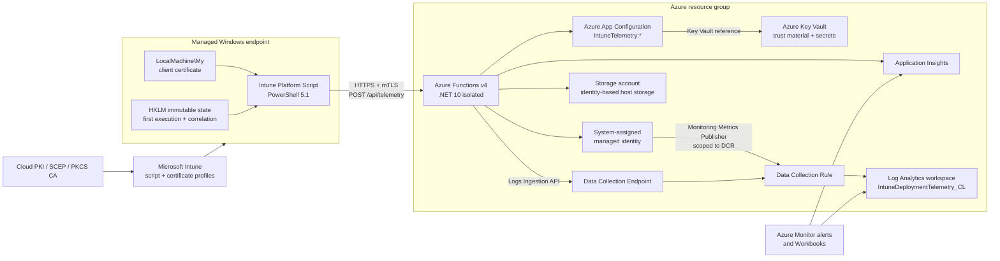
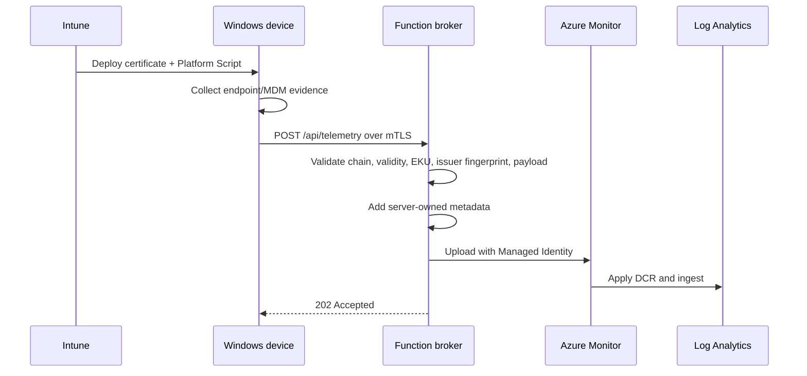

# 🏗️ Architecture

## Azure topology

Deploy each environment into a separate resource group. Production and
premium can also use separate subscriptions when organizational governance
requires stronger isolation.

## Design principles

- No Azure credential is distributed to endpoints in broker profiles. The
  `poc` direct-ingestion profile is an explicit documented exception.
- Every device receives a unique, renewable client certificate.
- Endpoint fields are untrusted until validated by the broker.
- Azure Monitor access uses managed identity and least-privilege DCR scope.
- Infrastructure is reproducible with Bicep.
- One codebase supports all deployment SKUs.

## Component model

| Component | Responsibility | Security boundary |
|---|---|---|
| Intune Platform Script | Collect local evidence and send one bounded payload | Untrusted endpoint |
| Intune certificate profile | Issue and renew a unique client certificate | Device identity |
| Azure Functions broker | Authenticate, validate, enrich, and ingest | Public service boundary |
| Managed Identity | Authenticate broker to Azure Monitor | Azure control plane |
| Azure App Configuration | Centralize broker runtime settings | Configuration plane |
| Azure Key Vault | Protect trust material and future secrets | Secrets plane |
| DCE / DCR | Define endpoint, schema, transform, and destination | Ingestion policy |
| Log Analytics | Retain and query tenant telemetry | Analytics data plane |
| Application Insights | Observe broker health and failures | Operations plane |

## Inbound security boundary

The Function App is the only internet-facing Azure component in the core
architecture:

- TLS 1.2 or later and HTTPS-only;
- App Service client-certificate mode set to `Required`;
- `/api/health` is the only certificate exclusion;
- `/api/telemetry` uses `AuthorizationLevel.Anonymous` intentionally because
  authentication occurs through mTLS before the Function executes;
- App Service forwards the client certificate through `X-ARR-ClientCert`;
- the broker validates validity period, Client Authentication EKU, custom
  certificate chain, and the immediate issuer CA SHA-256 fingerprint;
- CRL/OCSP validation uses `NoCheck` because private PKI publication points
  might not be reachable from Azure;
- body size, field lengths, arrays, timestamps, and JSON shape are bounded.

Issuer authorization doesn't bind the certificate subject to the reported
`AzureAdDeviceId`. This is an explicit trust-model decision: a certificate
from the approved issuing CA authorizes ingestion, while endpoint fields
remain untrusted telemetry.

## Azure authorization

The broker uses a system-assigned managed identity. It receives:

- **Monitoring Metrics Publisher** scoped to the individual DCR;
- **App Configuration Data Reader** scoped to the configuration store;
- **Key Vault Secrets User** scoped to the vault;
- the minimum Blob, Queue, and Table data-plane roles needed by Functions host
  storage;
- no workspace shared key, DCR secret, or application client secret.

The storage account disables Shared Key access. The public CA certificates
and issuer fingerprints are configuration values, not private keys.

## Configuration and secrets

Function App settings contain only the runtime bootstrap, identity-based host
storage, Application Insights, and `AZURE_APPCONFIG_ENDPOINT`.

Azure App Configuration stores operational settings under `IntuneTelemetry:`:
the Logs Ingestion endpoint, DCR ID, stream name, issuer CA fingerprints, and
request-size limit. The trusted-root bundle is stored in Key
Vault and exposed through an App Configuration Key Vault reference. Any future
secret must follow the same pattern and must never be stored directly in App
Configuration.

The broker resolves both services using its system-assigned managed identity.
Configuration is loaded when a worker process starts; restart the Function App
after rotating settings or trust material to guarantee immediate convergence.

## Request sequence

The broker returns `202` only after the Azure Monitor SDK accepts the upload.
Transient ingestion failures return `503`, allowing bounded client retry.

## Data contract and ingestion

The broker doesn't forward the endpoint JSON unchanged. It:

1. deserializes into a bounded, typed contract;
2. adds a server timestamp, request ID, leaf-certificate fingerprint, and
   issuer-certificate fingerprint;
3. serializes the normalized record expected by the DCR stream;
4. submits it to the Logs Ingestion API using managed identity;
5. returns success only when Azure Monitor accepts the batch.

The DCR maps `Custom-IntuneDeploymentTelemetry` to
`IntuneDeploymentTelemetry_CL`. Log Analytics stores analytical telemetry;
Application Insights stores broker operations and never the raw payload.
Every profile also deploys a shared Azure Monitor Workbook associated with the
workspace for customer-facing latency, distribution, trend, and per-device
evidence.

## Environment profiles

| Concern | `poc` | `dev` | `prod` | `premium` |
|---|---|---|---|---|
| Functions plan | None | Consumption Y1 | Elastic Premium EP1 | Elastic Premium EP2 |
| Warm instances | N/A | Scale to zero | 1 | 2 |
| Maximum scale-out | N/A | 10 | 20 | 50 |
| Zone redundancy | No | No | Region-dependent | Yes, supported regions |
| Log retention | 30 days | 30 days | 90 days | 365 days |
| Daily cap | 1 GB | 1 GB | 20 GB | 100 GB |
| App Configuration | None | Free | Standard | Standard |
| Network posture | Direct public DCR endpoint | Public mTLS endpoint | Public mTLS endpoint | Public mTLS; private/WAF extension point |

The development profile prioritizes low cost and can exhibit cold starts.
Elastic Premium is used in production because pre-warmed workers remove
broker startup noise from the latency measurement itself.

The Proof of Concept (`poc`) profile is a deliberately different direct
ingestion architecture. It transfers the Azure authentication boundary to
untrusted endpoints and is documented in the
[Proof of Concept direct-ingestion plan](poc-direct-ingestion.md).

## Reliability

- Client and SDK retries use bounded exponential backoff.
- Every request has a client execution ID and server request ID.
- Payload fields and nested arrays are bounded.
- Function Premium SKUs keep warm workers.
- Premium uses zone-redundant workers where the selected region supports it.
- Log Analytics daily caps prevent uncontrolled spend.

Recommended alerts:

- sustained broker `5xx`;
- certificate rejection spikes;
- Logs Ingestion API failures or throttling;
- no accepted telemetry during an expected deployment window;
- workspace daily-cap approach or breach;
- Function health-check failure.

## Optional premium edge

Do not place Azure Front Door in the certificate path unless its selected SKU
and generally available feature set can preserve the required client identity.
If WAF or private ingress becomes mandatory, add Application Gateway WAF v2 as
a separate edge module, terminate mTLS there, use private connectivity to the
Function App, and accept forwarded certificate metadata only from that trusted
gateway. This is an extension of the premium profile, not a requirement for
the core deployment.

## Privacy

UPN, event text, and device identifiers can be personal or operational data.
Before production:

- decide whether UPN is required;
- document purpose and retention;
- restrict workspace RBAC;
- select the correct region;
- avoid logging raw payloads in Application Insights;
- implement deletion/export procedures required by policy.
